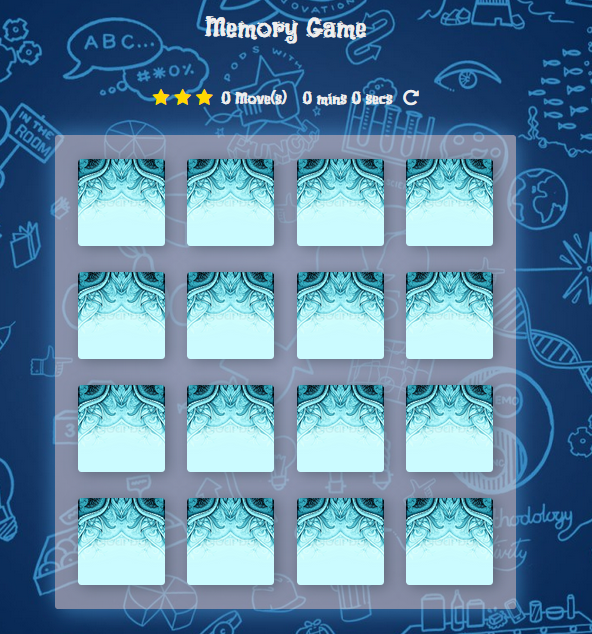

# Memory Game Project
* [Introduction](#introduction)
* [Dependencies](#Dependencies)
* [Copyright](#copyright)

## introduction
The Memory Game to test the player's memory. the player have to match each symbol to win the game.

### how to play
* Click on a card
* Keep revealing cards and working your memory to remember each unveiled card.
* Match cards properly with less moves and in faster time.

## The Challenge
Win the with 8 moves and get 3 stars
Win the with 13 moves and get 2 stars
Win the with more than 13 moves and get 1 stars

## Dependencies
 I've used the follow Websites:
* Fontawesome for the Icons (symbol)
* Google Fonts for the following font: Black And White Picture

## How I built the Memory Game
* I manipulated the DOM
* a deck of cards that shuffles when game is refreshed
* a counter to count the number of moves made by player
* added effects to cards when they match and unmatched
* create a pop-up modal when player wins game

## copyright
this game start code has been taken from https://github.com/udacity/fend-project-memory-game and javascript has been written by Abdulrahman Hasan.
